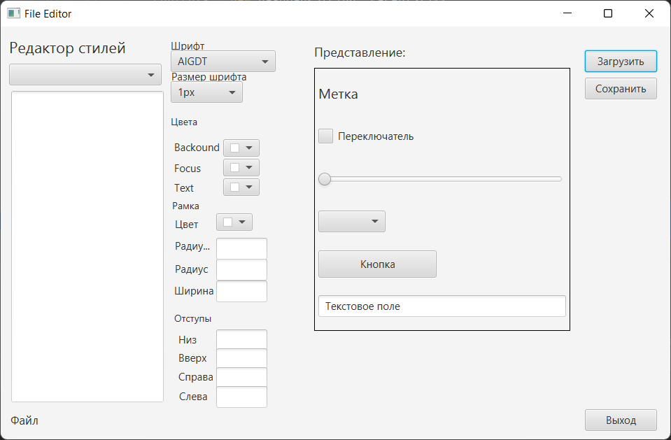

## [Редактор](https://github.com/range36rus/cssfx-style-editor.git)
  Редактор CSS-стилей предназначен для редктирования css-стилей для fxml-форм.
  Изменения внесенные в css в текстовом редакторе, оперативно отображаюся в окне пользовательского интерфейса.
### Используемые методы и технологии программирования
  1. Смена сцен 
### Паттерны 
### Инструменты
