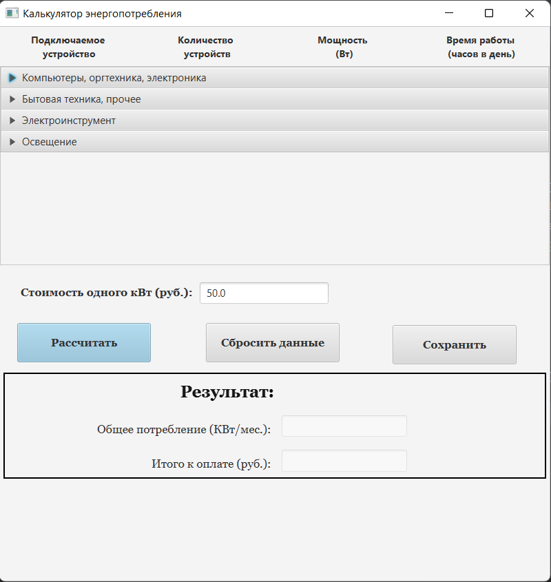

# Калькулятор
Калькулятор энергопотребления предназначен для расчета суммарного энергопотребления различных устройств. GUI позволяет вводить/изменять значения потребляемой мощности, часов работы. Для инициализации полей загружается файл настроек, содержащий значения потребляемой мощности, используемые по умолчанию. Предусмотрена возможность его изменения на основе новых данных, получаемых от пользователя.

## Используемые методы и технологии программирования
  1. Механизм связывания для автогенерации полей GUI на основе данных в текстовом файле.
  
  Binding API (механизм связывания) предоставляет некоторые интерфейсы (например, метод bind () для одностороннего связывания), которые автоматически уведомляют объекты, когда происходит изменение значения другого объекта.
  
  2. Техника чтения из файла.
  
  Потоковый ввод-вывод с использованием классов из пакета java.io.
## Паттерны  
  1.	Использование паттерна Абстрактная фабрика для вывода значений из файла как в виде текстового поля, так в виде списка.
 
Паттерн Абстрактная фабрика позволяет создавать  семейства объектов, не инстанцируя (специфицируя) классы явно, при  этом  обеспечивается логическая связанность создаваемых объектов. 
## Инструменты
  1. Использование системы сборки Gradle.

